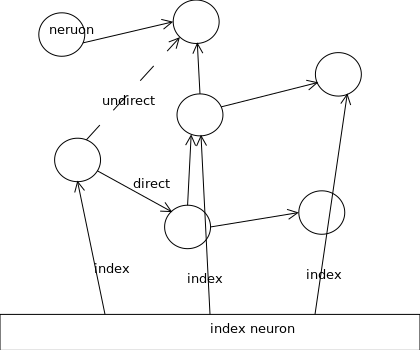

# 主旨 : 
通过简单的规则,让学习的网络携带语言涌现出更多的创意和联想

# 参考例程
> 水槽中拔掉塞子,由于水在重力的简单作用下,涌现出意外的现象.水的旋涡,呈现出倒3圆锥状的形态

> 鱼群算法,每只遵守,和左,右,前鱼保持一定的距离,但是又不能太远,首鱼往左,右,前方向随机运动,寻找蜉蝣生物,整体展现出群体行为.

# 规则
- 语言输入后按照词库,和语法形态进行分词.
- 将分词,按照顺序依次输入到网络中.
- 每一个词,按照概率依次递减的形式,记录与句子中其他词语的联系,分直接连接词和间接连接词
- 每一个词语,出现一次,增加一次计数num,按照现实时间戳计算一次概率\
    p(综合)=p(间接)*w1+p(直接)*w2+p(时间戳,计数)*w3 \
    p(时间戳,计数)=exp(-(dt-86400*1000))f(num & 1|2^10|2^20)
- 激活刺激扩散,按照激活概率p(active)选择是否激活周边神经元,
    选择激活,则排序选择最优的n个,n也是随机出来的, 发送刺激信号(也是结构体,记录激活层次,激活强度).
- 激活信号强度,计算公式.(当level达到一定数后,直接消亡)
    p(active)=[exp(dt-86400*1000)]^level
- 消亡,每次刺激后,以一定的概率产生,消亡神经元,消亡后,做记号,阻断刺激的传递.
- 复制,每次刺激后,以一定的概率产生,复制神经元,与原神经元之间,直接连接,概率1.
- 变异,每次刺激后,以一定的概率选择,周边其他神经元互换结构.

- 输入神经元,以索引的方式保持
- 每次出入词汇,从索引位置开始,计算增益,引发的刺激获取权重最大,则按刺激点,随机选出,刺激网络中直接和间接的神经元.

# 其他设想机制
- E=mc^2 能量的释放,用于激活信号扩散
- 量子的纠缠效应,多个远距神经元,存在信息共享
- 刺激信号的,量子层级释放

# 现有技术实现难度
- 单个神经元的自制能力和计算能力有限
- 串行计算的能力消耗量,必须限制扩散规模
- 涉及神经元过多的时,计算时间延迟

# 实现技术和手段
- graph db 记录网络和连,应该为单向网络
- golang 的协程,性能和消耗少,可以模拟单个神经元的计算
- 接入精神元,可以用redis做索引链接